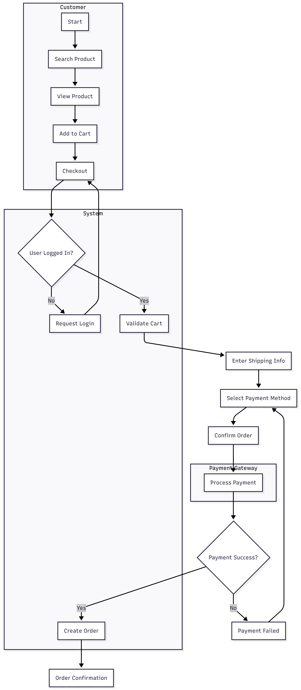
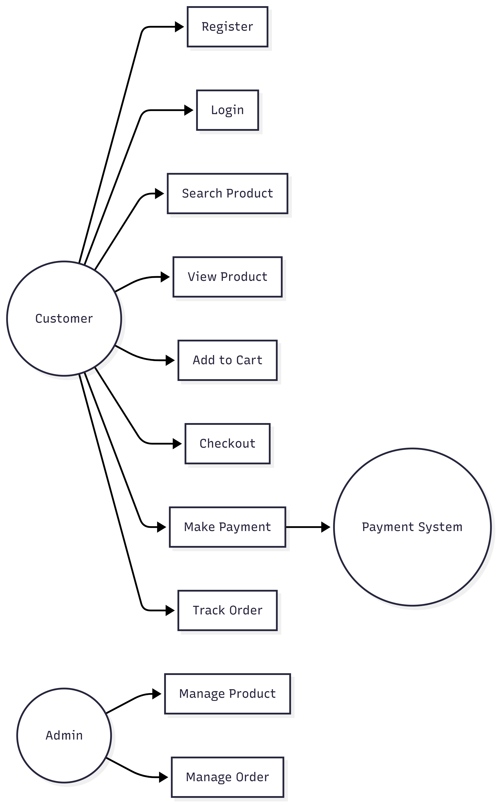
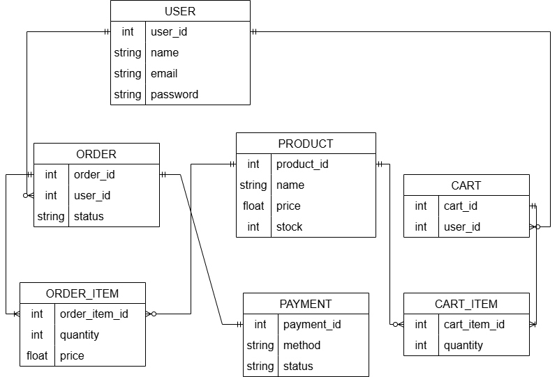

# 🛒 E-commerce System Project

## 📌 1. Project Overview

This project analyzes and designs an end-to-end e-commerce system, focusing on improving user shopping experience and optimizing conversion rate.

## 🎯 2. Business Problem

* Users find it difficult to search for products efficiently
* High cart abandonment rate during checkout
* Lack of transparency in order tracking

## 💡 3. Proposed Solution

* Implement optimized product search & filtering
* Simplify checkout flow
* Provide real-time order tracking

## 🔄 4. Business Process Flow

## 🧩 5. System Design

### 📊 UML Diagrams

* Use Case Diagram
* Sequence Diagram (Checkout & Payment)
* Activity Diagram
* State Machine (Order lifecycle)

### 🗄 Data Model

* ERD (User, Product, Cart, Order, Payment)

## 📸 6. Key Diagrams

### 🔹 Use Case

### 🔹 ERD

## 🧾 7. Documentation

* BRD (Business Requirement Document)
* SRS (Software Requirement Specification)
* User Stories & Acceptance Criteria
* API Specification

## 🛠 8. Tools & Technologies

* Requirement Analysis  
* UML & BPMN Modeling  
* ERD (Data Modeling)
* Draw.io (Diagrams) 

## 📈 9. Key Business Insights

* Checkout is the most critical step affecting conversion rate
* Simplifying payment flow reduces drop-off
* Fast product search improves user engagement

## 🚀 10. Key Learnings

* How to design end-to-end business processes
* Writing clear and testable requirements
* Translating business needs into system design

## 👤 11. Author

* Name: Nguyễn Thị Liễu
* Role: Business Analyst

